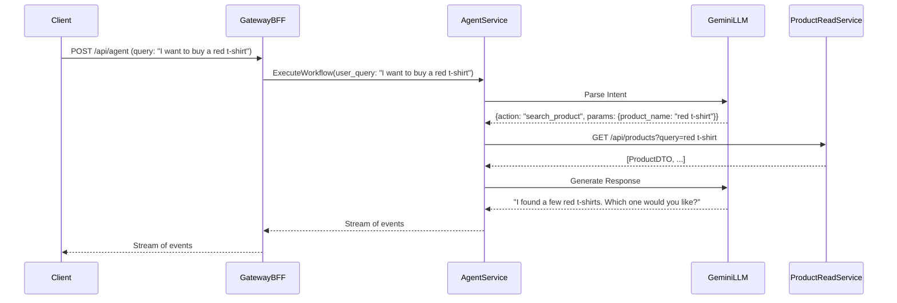

# AI Agent Design Document

## 1. Overview

This document outlines the design for a new AI agent layer for the community platform. The AI agent will provide an autonomous shopping experience for users, allowing them to interact with the platform using natural language. The agent will be able to understand user queries, search for products, add them to the cart, and initiate the checkout process.

The primary goal of this project is to achieve a >90% successful agentic checkout rate. This will be accomplished by creating a robust and scalable AI agent that is tightly integrated with the existing microservices.

## 2. Architecture

The proposed architecture is centered around a new service called the `agent-service`. This service will be responsible for orchestrating the entire AI agent workflow. It will use the LangGraph library to define the agent's logic as a stateful graph.

The `agent-service` will communicate with the other microservices in the system via gRPC and REST APIs. It will also communicate with the user's client application via a streaming gRPC connection, which will be exposed through the `gateway-bff`.

The existing AI services (`intent-parser`, `plan-generator`, and `plan-executor`) will be deprecated and replaced by the new `agent-service`. This will simplify the architecture and improve performance by reducing the number of HTTP requests required to process a user query.

Here is a high-level diagram of the proposed architecture:

```
[Client Application] <--> [Gateway BFF] <--> [Agent Service] <--> [Other Microservices]
                                             ^
                                             |
                                             v
                                        [Gemini LLM]
```

## 3. Services

This section provides a detailed description of each service involved in the AI agent workflow.

### 3.1. Agent Service

*   **Description:** The `agent-service` is the heart of the AI agent system. It is responsible for orchestrating the entire workflow, from parsing the user's intent to executing the necessary actions.
*   **Technology:** Python, LangGraph, gRPC, FastAPI
*   **API:** The `agent-service` will expose a gRPC API with a single `ExecuteWorkflow` method. This method will take a user query and stream back the events of the workflow's execution.
*   **Communication:**
    *   **`gateway-bff`:** Communicates with the `gateway-bff` via gRPC.
    *   **Other Microservices:** Communicates with the other microservices via gRPC and REST APIs.
    *   **Gemini LLM:** Communicates with the Gemini LLM to parse the user's intent.

### 3.2. AI Services (Legacy)

*   **Description:** The existing `intent-parser`, `plan-generator`, and `plan-executor` services will be deprecated and replaced by the new `agent-service`.
*   **Technology:** Python, FastAPI
*   **API:** REST
*   **Status:** To be deprecated.

### 3.3. Product Service

*   **Description:** The `product-read` service is responsible for providing information about products.
*   **Technology:** Java, Spring Boot
*   **API:** REST
    *   `GET /api/products`: Get all products.
    *   `GET /api/products/{id}`: Get a product by its ID.
*   **Communication:**
    *   **`agent-service`:** The `agent-service` will communicate with the `product-read` service via its REST API.

### 3.4. Cart Service

*   **Description:** The `cart-crud` service is responsible for managing shopping carts.
*   **Technology:** TypeScript, Express
*   **API:** REST
    *   `GET /api/v1/carts/:userId`: Get the cart for a user.
    *   `POST /api/v1/carts/:userId/items`: Add an item to the cart.
    *   `PUT /api/v1/carts/:userId/items/:productId`: Update the quantity of an item in the cart.
    *   `DELETE /api/v1/carts/:userId/items/:productId`: Remove an item from the cart.
*   **Communication:**
    *   **`agent-service`:** The `agent-service` will communicate with the `cart-crud` service via its REST API.

### 3.5. Checkout Service

*   **Description:** The `checkout-orchestrator` service is responsible for managing the checkout process. It uses a saga pattern to coordinate the different steps of the checkout, such as reserving inventory and creating an order.
*   **Technology:** Python, FastAPI, Kafka
*   **API:** REST
    *   `POST /api/checkout`: Initiates the checkout saga.
*   **Communication:**
    *   **`agent-service`:** The `agent-service` will communicate with the `checkout-orchestrator` service via its REST API.
    *   **Kafka:** The `checkout-orchestrator` service communicates with other services (e.g., `inventory-service`, `order-service`) via Kafka events.

## 4. Legacy AI Services Analysis

This section provides an analysis of the existing AI services and their usefulness for the new `agent-service`.

### 4.1. `intent-parser`

*   **Analysis:** This service is responsible for parsing the user's query and extracting their intent. It uses a very detailed and well-structured prompt to instruct the Gemini LLM on how to do this. The prompt includes the Pydantic schema for the `Intent` and `Action` models, a list of supported actions and their parameters, and examples of how to handle different user queries.
*   **Recommendation:** The prompt from this service is a valuable asset and should be reused in the new `agent-service`.

### 4.2. `plan-generator`

*   **Analysis:** This service is responsible for generating a plan of actions based on the user's intent. It's a simple, rule-based service that maps each intent to a sequence of actions.
*   **Recommendation:** This service is not very flexible and will be replaced by the more powerful and flexible LangGraph engine in the new `agent-service`.

### 4.3. `plan-executor`

*   **Analysis:** This service is responsible for executing the plan generated by the `plan-generator`. It iterates through the actions in the plan and makes HTTP calls to the other microservices to perform the actual actions.
*   **Recommendation:** The logic in this service for calling the other services is a good reference, but the new `agent-service` will use gRPC where possible to improve performance.

## 5. Implementation Plan

This section provides a step-by-step plan for implementing the new `agent-service`.

1.  **Set up the project:** Create a new Python project for the `agent-service` using Poetry.
2.  **Define the gRPC service:** Create the `agent.proto` file and generate the Python gRPC code.
3.  **Define the agent's state:** Define a `TypedDict` that will represent the state of the agent.
4.  **Define the tools:** Define the tools that the agent can use to interact with the other microservices. Use the `fastmcp` library to define the tools.
5.  **Create the agent node:** Create a function that will be the main node of the agent. This function will call the Gemini LLM to parse the user's intent and decide which tool to use. The prompt from the `intent-parser` service should be used here.
6.  **Create the tool executor node:** Create a function that will execute the tools that the agent decides to use.
7.  **Build the graph:** Use the `StatefulGraph` class from LangGraph to build the agent's workflow.
8.  **Implement the gRPC server:** Implement the `ExecuteWorkflow` method of the `AgentService` to execute the LangGraph agent and stream the results back to the client.
9.  **Integrate with other services:** Replace the dummy implementations of the tools with actual gRPC and REST calls to the other microservices.
10. **Write tests:** Write unit, integration, and golden-path tests for the new `agent-service`.

## 6. Workflow

This section describes the end-to-end workflow for the AI agent, from the user's query to the final response.

1.  **User Query:** The user sends a natural language query to the `gateway-bff`. For example: "I want to buy a red t-shirt."
2.  **gRPC Request:** The `gateway-bff` forwards the user's query to the `agent-service` via a gRPC request to the `ExecuteWorkflow` method.
3.  **Intent Parsing:** The `agent-service` calls the Gemini LLM to parse the user's intent. The LLM returns a structured JSON object that represents the user's intent. For example:
    ```json
    {
      "action": "search_product",
      "params": {
        "product_name": "red t-shirt"
      }
    }
    ```
4.  **Tool Execution:** The `agent-service` uses the intent to select the appropriate tool to execute. In this case, it would be the `search_product` tool.
5.  **Service Interaction:** The `search_product` tool function makes a REST API call to the `product-read` service to search for the product.
6.  **Tool Response:** The `product-read` service returns a list of products that match the search query.
7.  **Response Generation:** The `agent-service` receives the list of products and uses the LLM to generate a natural language response to the user. For example: "I found a few red t-shirts. Which one would you like to add to your cart?"
8.  **Streaming Response:** The `agent-service` streams the events of the workflow, including the agent's response, back to the `gateway-bff`, which then streams them to the client.

### 6.1. Sequence Diagram

Here is a sequence diagram that illustrates the workflow for the "I want to buy a red t-shirt" use case:



## 7. Communication Protocols

This section summarizes the communication protocols used between the services in the AI agent workflow.

*   **Client <-> Gateway BFF:** HTTP (REST)
*   **Gateway BFF <-> Agent Service:** gRPC (streaming)
*   **Agent Service <-> Gemini LLM:** HTTPS
*   **Agent Service <-> Product Read Service:** HTTP (REST)
*   **Agent Service <-> Cart CRUD Service:** HTTP (REST)
*   **Agent Service <-> Checkout Orchestrator:** HTTP (REST)
*   **Checkout Orchestrator <-> Other Services:** Kafka

